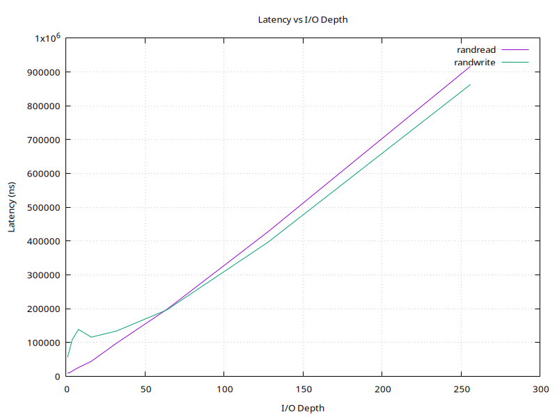

# blktest
Утилита для тестирования производительности блочных устройств с использованием Fio и Gnuplot.

## Зависимости
python 3.12  
fio и gnuplot - linux утилиты

## Пример создания случайного тестового файла
dd if=/dev/zero of=testfile bs=1G count=1

## Пример использования
python blktest.py --name=test1 --filename=testfile --output=graph.png

## График полученный при тестовом запуске

